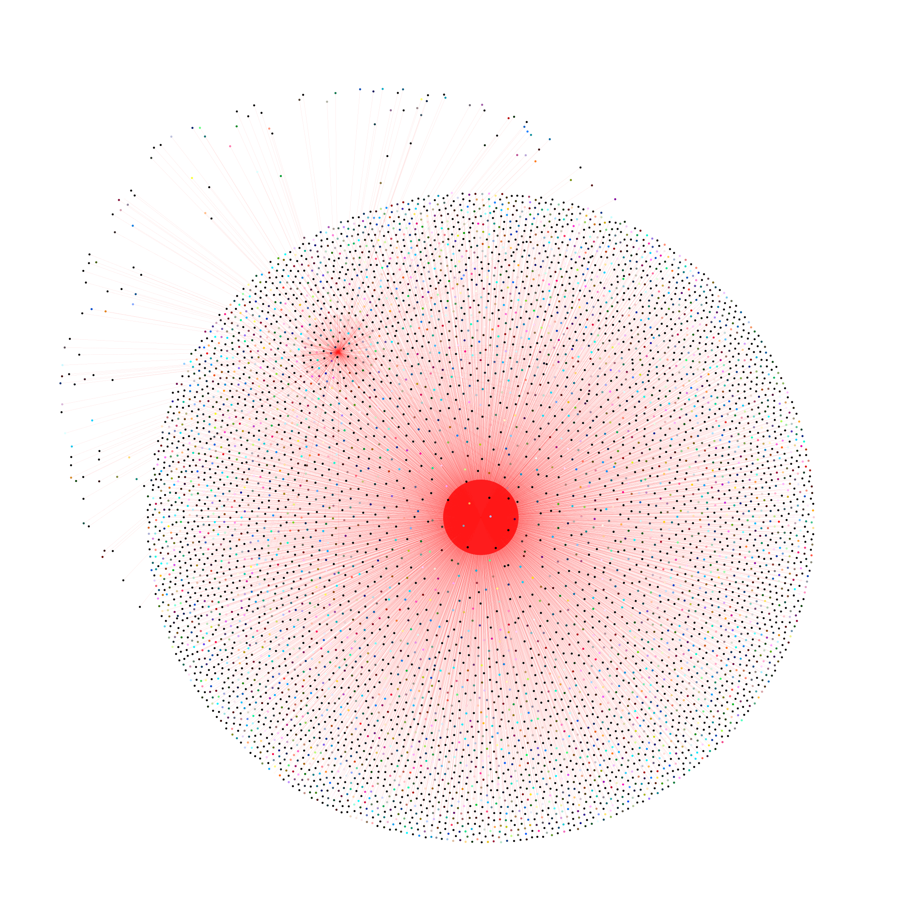

# Twitter Graph Analysis

- This is part of a Social Network Analysis project 
- Completely written in Julia

## Instructions

- Saved "notebook" in html format so have a look at "main.html" if you want to see outputs directly
- All images saved in imgs folder

## Plots so far

- Graph of all people with (> 10,000 followers)

# TO DO List

- Compare every function with networkX
- Clusters (x)
- Graph coloring (x)
- Adjacency (x)
- Popularity
- Graphs by a particular charactersitic (x)

# Timing

## Julia

- Load 10000 nodes, 10000 edges -> 13.9ms
- Graph coloring -> 18.3s
- Adjacency -> 2ms
- Kmeans -> 4.7ms

- Load 90355 nodes, 60000 edges -> 239ms
- Graph coloring -> 137s
- Adjacency -> 17.6 ms
- KMeans -> 266ms
- Plot country wise grouping -> 60s

## Python
- Load 10000 nodes, 10000 edges -> 52ms
- Graph coloring -> 49ms
- Adjacency -> 72ms
- Kmeans -> 180ms

- Load 90355 nodes, 60000 edges -> 239ms
- Graph coloring -> 248ms
- Adjacency -> 225ms
- KMeans -> 1.81s
- Plot country wise grouping -> 68s

